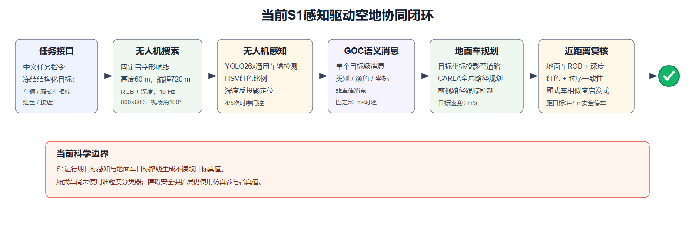
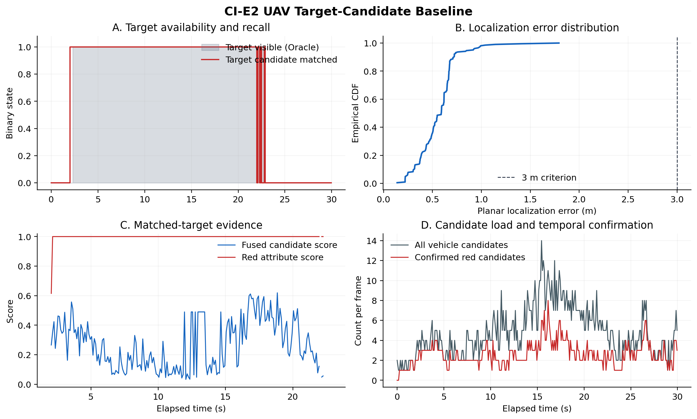
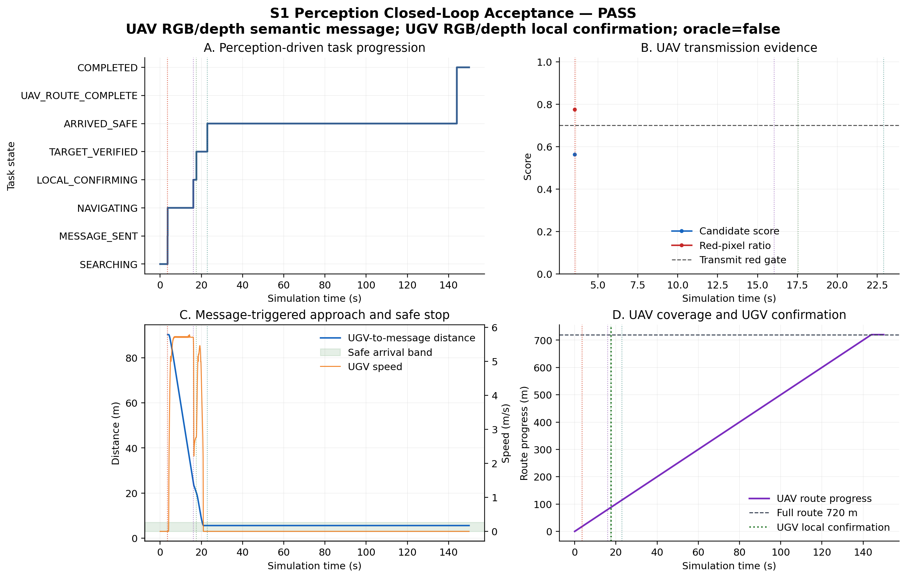
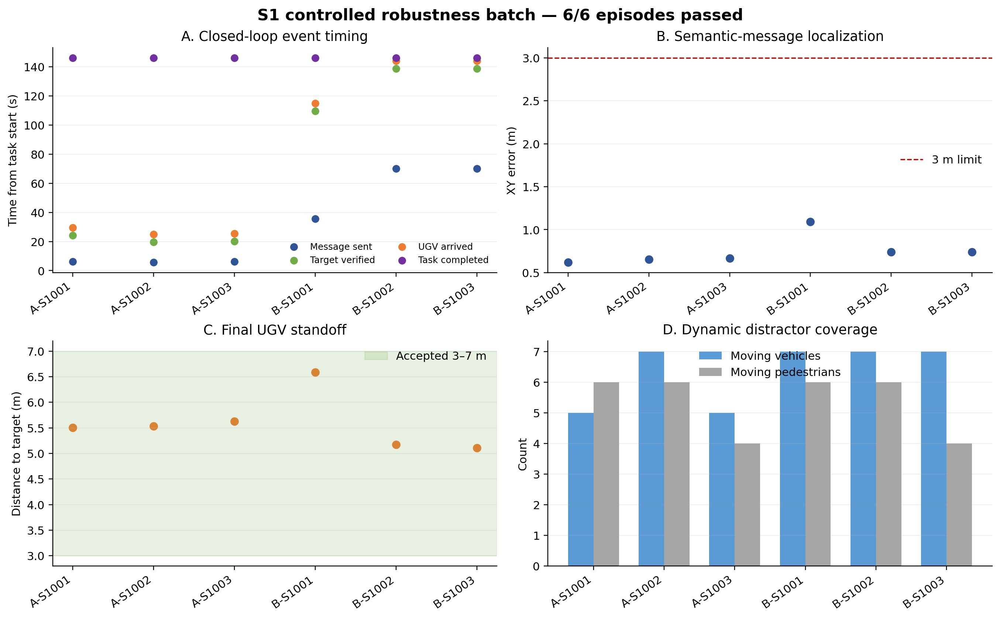

# 城市巡检空地协同视觉语言导航实验周报

**时间范围：2026-09-21—2026-09-24**  
**当前最高完成阶段：S1 感知驱动闭环，三随机种子 × 两目标位置批量验收**

## 1. 一句话结论

本周完成了从“可重复仿真场景与同步双端传感器”到“UAV基于RGB/深度发现目标、发送非Oracle语义消息、UGV据此规划并在近端复核后安全停车”的完整闭环，并在Town10HD/Zone A的3个动态干扰随机种子和2个固定目标位置上取得6/6通过结果。

这证明当前系统已经具备**受控场景下的任务级闭环可行性与初步鲁棒性**；但车辆细粒度类别、颜色泛化、纯视觉避障、真实通信扰动和跨地图泛化尚未完成，不能把当前结果表述为最终视觉语言导航或GOC最优算法。

## 2. 当前任务及系统闭环

冻结指令为：“寻找一辆红色厢式货车，并前往其所在位置。”

当前实现把任务分成六步：UAV按弓字形航线搜索；UAV从同步RGB和深度中生成车辆候选；用红色属性、时序一致性和可解释的`van-like`分数选择候选；发送一条目标级语义消息；UGV根据消息中的世界坐标规划道路路线；UGV接近后用自身RGB/深度再次确认，并在目标外3–7 m安全停车。

需要准确区分三种信息：

- **运行期任务输入**：UAV/UGV同步RGB、深度、相机内外参、冻结的结构化指令；
- **运行期目标信息**：只来自UAV感知消息，消息标记为`oracle=false`；
- **仿真真值**：目标真值只用于仿真后评价；但当前障碍物紧急制动保护层仍使用CARLA actor位置，应称为“真值安全盾”，不能称为纯视觉避障。

## 3. 本周完成的实验链条

| 阶段 | 使用方法 | 完成的实验 | 主要效果 |
|---|---|---|---|
| CI-E0 场景冻结 | Town10HD区域勘察、配置化场景生成、同步模式 | 固定Zone A、指令、红色Sprinter、UGV/UAV出生点及干扰物 | 34/34项通过；建立可复现实验基准 |
| CI-E1 动态采集 | CARLA 0.05 s固定步长；双端RGB/深度10 Hz | 车辆、行人、UGV和UAV同时运动并同帧采集 | 完整航线1500/1500共同帧，最大帧差0 |
| CI-E1完整航线 | UAV 60 m高度、720 m弓字航线 | 150 s完整搜索；UGV动态运行 | UAV完成10航点、9航段、4折返 |
| CI-E1.1物理修复 | 宽视角、碰撞监测、分级制动、安全停车 | 修复UGV撞车、UAV穿模和视野过窄 | UAV/UGV碰撞0/0；最终距离6.11 m |
| CI-E2候选基线 | YOLO26x + HSV红色 + 深度反投影 + 3/5时序确认 | UAV离线候选生成与Oracle后评估 | 目标召回98.04%；定位中位误差0.59 m |
| S0 Oracle闭环 | CARLA目标坐标经Oracle消息发送 | 验证状态机、通信、规划、控制及负对照 | 正向完成；无消息时UGV位移0 m |
| S1感知闭环 | UAV候选门控 + 非Oracle语义消息 + UGV近端复核 | 单组150 s在线感知闭环及无消息负对照 | 36/36项通过；错误消息0；安全到达 |
| S1受控批量 | 3个干扰种子 × 2个固定目标位置 | 6组完整闭环、统一验收和紧凑存储 | 6/6通过；定位误差0.618–1.092 m |

## 4. 当前各模块到底用了什么算法

### 4.1 指令处理

当前没有在线调用大语言模型或视觉语言模型。中文指令被预先冻结为结构化目标：

`object=vehicle, subcategory=van, color=red, action=approach`

因此当前验证的是**结构化语言目标驱动的视觉搜索与导航接口**，还不能声称实现了开放词汇语言理解或端到端视觉语言导航。

### 4.2 UAV搜索策略

UAV使用预先规划的弓字形覆盖航线：60 m高度、5 m/s、720 m总长、10个航点、9段航线和4次折返。相机固定世界北向、俯视，分辨率800×600，水平视场角100°。

这是确定性覆盖搜索，不是强化学习或根据目标概率自适应调整的搜索策略。它的作用是固定搜索覆盖，便于比较感知与通信模块。

### 4.3 车辆候选检测

车辆检测使用Ultralytics `YOLO26x`的COCO预训练权重，只保留`car`、`motorcycle`、`bus`和`truck`四类；推理尺寸1280，最低检测置信度0.03，并进行类别无关NMS。

俯视小目标漏检时，系统还会从HSV红色连通区域产生补充候选，并用观测深度估算物体足迹和离地高度，排除红色建筑立面、道路标记和小型标牌。但在正式S1消息门控中，**只有YOLO产生的车辆框允许触发消息**，红色区域补充候选不能单独触发UGV行动。

当前“厢式车”不是一个学习得到的细粒度类别。系统采用透明的`van_like_score`：

- COCO类别先验：`bus=0.95`、`truck=0.90`、`car=0.62`；
- 根据二维框长宽比增加最多0.08的形状分；
- UGV本地复核要求`van_like_score ≥ 0.60`。

所以正确表述是“通用车辆检测 + 厢式车相似度启发式”，不能表述为“已训练出高精度厢式货车识别模型”。尤其普通`car`的先验已经是0.62，当前分数主要用于排除明显非车辆候选，而不是可靠地区分轿车和厢式货车。

### 4.4 红色属性判断

颜色识别目前是规则法，不是神经网络属性分类器。系统在检测框内部区域转换到HSV空间，用两个色相区间覆盖红色环绕区：

- `H∈[0,12]`或`H∈[168,179]`；
- `S≥75`且`V≥45`；
- 红色像素比例定义为满足条件的像素数除以ROI像素数。

候选生成阶段以0.10作为“红色”初筛阈值；UAV正式发送门限提高到0.70；UGV近端复核门限为0.35。不同门限反映了远距离发送需要高精度，而近距离视角、阴影和遮挡下允许更宽松的颜色比例。

CI-E2中的“目标颜色正确率100%”只针对已经与Oracle目标匹配的200个命中帧，表示这些目标框都被判断为红色；它**不是所有候选的总体颜色分类准确率**。所有红色候选的精度代理只有20.67%，说明红色背景物和同色干扰仍较多。

### 4.5 深度定位

定位不读取目标真值。系统在检测框中央50%区域中筛选0.5–250 m有效深度，取中位数作为稳健距离；再使用针孔模型反投影：

`f = W / [2 tan(FOV/2)]`

根据框中心像素、焦距和深度得到相机坐标，最后乘以传感器到CARLA世界坐标的齐次变换矩阵，输出目标世界坐标`[x,y,z]`。

CI-E2得到平面定位误差中位数0.589 m、P90为0.688 m；S1六组最终发送消息的定位误差为0.618–1.092 m，均低于3 m验收门限。

### 4.6 时间一致性与目标选择

感知每5个传感器帧推理一次，即2 Hz。在最近5次推理中，如果红色候选的世界坐标在5 m关联半径内重复出现，就形成稳定轨迹。

S1发送消息要求：YOLO车辆框、红色比例≥0.70、至少4/5次命中、检测分数≥0.03、世界高度0.4–4.5 m。候选排序分数为：

`S = 0.45·红色比例 + 0.30·检测分数 + 0.15·时序命中比例 + 0.10·van-like分数`

通过门控后只发送一次消息，避免把逐帧图像或全部候选持续传给UGV。

### 4.7 通信

当前传输的是目标级语义消息，而不是图像、点云或中间特征。消息包含目标类别、红色属性、估计世界坐标、定位不确定度、检测/颜色/`van-like`分数、轨迹ID和源帧证据。

通信延迟固定为1个仿真步，即50 ms；没有加入随机丢包、排队、带宽竞争或编码开销。因此当前证明的是**GOC语义接口能够驱动任务闭环**，不是通信策略或无线网络性能已经最优。

### 4.8 UGV路线规划与控制

UGV在收到消息前保持静止。收到目标估计坐标后：

1. 将坐标投影到最近的CARLA可驾驶车道；
2. 使用CARLA `GlobalRoutePlanner`按2 m分辨率生成道路拓扑路线；
3. 如果CARLA规划器不可用，则使用带欧氏启发项的A*式车道搜索作为兼容后备；
4. 路线跟踪使用前视点控制：在单调路线游标前方选择第6个路线点，根据航向误差计算转向；
5. 纵向使用基于速度误差的比例式油门/制动控制，目标速度6 m/s；
6. 距目标14 m内逐步减速，约5 m处停车并保持2 s。

路线游标只允许在有限前向窗口内单调推进，解决了环路或空间接近路段导致的路线索引跳跃问题。

UGV接近消息坐标25 m以内、且沿路线剩余距离不超过30 m时启动自身RGB/深度复核。复核要求候选与消息坐标相差≤5 m、红色比例≥0.35、至少3次时序命中、检测分数≥0.10、`van-like_score≥0.60`。若到8 m仍未确认，车辆先停车等待；确认后才允许进入最终安全停车状态。

当前碰撞安全盾使用CARLA actor真值计算前方3 m走廊内的障碍距离：14 m内减速、6 m内紧急制动。因此当前可以声称“目标驱动导航不读取目标真值”，但不能声称“动态避障完全由车载视觉实现”。

### 4.9 Oracle是什么意思

`Oracle`可直译为“理想信息源”或“真值先验”。在仿真实验中，它表示算法直接获得模拟器内部的正确答案，例如目标车辆的真实坐标、真实类别或真实可见状态。Oracle不是一种检测算法，而是一种**上界条件和对照实验工具**。

本项目中Oracle有三种明确用途：

1. **S0 Oracle闭环**：UAV不运行视觉识别，直接使用CARLA目标真实坐标构造`oracle=true`消息。其目的不是证明感知能力，而是先验证状态机、通信、UGV路线规划、控制和数据记录是否能够在“目标信息完全正确”时工作。S0相当于系统闭环上界。
2. **CI-E2离线评价Oracle**：所有图像推理完成后，使用目标真实位置判断“目标是否可见”“哪个候选与真实目标匹配”以及“定位误差是多少”。真值只参与评分，不进入候选生成。
3. **S1感知闭环的后评估**：在线消息标记为`oracle=false`，目标坐标来自RGB/深度感知；实验结束后才用Oracle真值计算消息定位误差、错误目标消息和最终停车距离。

Oracle的实验逻辑是：如果S0都失败，说明问题在通信、规划、控制或状态机；如果S0通过而S1失败，才说明主要瓶颈在感知。因此S0必须保留，但不能把S0结果当作最终感知性能。

还要单独说明：当前UGV障碍紧急制动安全盾读取CARLA参与者真值。这属于“真值安全保护层”，不是S0的Oracle目标消息，也不参与目标识别和目标路线生成，但意味着目前尚未完成纯视觉动态避障。

## 5. 感知候选实验结果

这张图评价的是30 s、300帧UAV候选基线。感知输入只有UAV RGB、同帧米制深度和相机位姿；Oracle真值仅在推理结束后用于判断可见性、候选匹配和定位误差。

**图A：目标可见性与召回情况**

- 横轴是从数据开始算起的仿真时间，约0–30 s；纵轴是二值状态，1表示“是”，0表示“否”。
- 灰色填充`Target visible (Oracle)`是后评估真值：目标中心投影必须落在图像内，并且投影点的观测深度与目标理论深度相差不超过6 m。它只定义评价分母，不提供给检测器。
- 红线`Target candidate matched`表示该帧是否存在世界坐标距真实目标5 m以内的候选。
- 目标约从2 s到22 s持续可见。204个Oracle可见帧中有200帧找到匹配候选，召回率为`200/204=98.04%`；接近可见区末端的少量红线跌落对应4个漏检帧。
- 该图说明目标进入候选集的稳定性较好，符合CI-E2“高召回候选生成”的预期，但不表示其他候选都是正确目标。

**图B：平面定位误差累计分布**

- 横轴是候选世界坐标与目标真值在XY平面内的欧氏距离误差，单位为m；纵轴是经验累计分布CDF。
- 读图方法：给定横轴误差值，纵轴表示不超过该误差的样本比例。例如CDF=0.5对应中位误差，CDF=0.9对应P90误差。
- 中位误差为0.589 m，P90为0.688 m；只有极少数尾部样本延伸到约1.8 m。虚线是3 m验收上限，全部有效样本均在其左侧。
- 该结果说明“框中央深度中位数 + 针孔反投影”在当前60 m俯视、静态目标和CARLA理想深度条件下能够提供米级以内定位。它不能直接外推到真实深度噪声、标定误差或强遮挡场景。

**图C：已匹配目标的感知证据**

- 横轴是仿真时间；纵轴是0–1范围的证据分数。曲线只在存在目标匹配候选时有值，空白区不代表分数为0，而是没有匹配样本。
- 蓝线`Fused candidate score`是候选生成阶段的融合分数：检测置信度乘以颜色加权项；它不是分类概率，也不是S1最终的指令匹配分数。
- 红线`Red attribute score`是由HSV红色像素比例换算得到的属性置信度，不是神经网络输出的颜色概率。红线大部分饱和在1，说明已匹配目标的红色区域稳定。
- 蓝线约在0.05–0.62之间波动，反映俯视尺度、观察角度和YOLO检测置信度变化；颜色证据稳定并不等于车辆子类识别稳定。

**图D：候选负载与时间确认**

- 横轴是仿真时间；纵轴是每帧候选数量。
- 灰线`All vehicle candidates`包含YOLO车辆框和指令引导的红色区域补充候选，每帧约2–14个。
- 红线`Confirmed red candidates`表示被判为红色且满足3/5时间一致性的候选，每帧约0–8个。红线通常低于灰线，说明时间确认去除了部分瞬时噪声。
- 300帧共产生1443个候选，其中982个为红色候选；与真实目标匹配且颜色正确的计数相对所有红色候选得到20.67%的精度代理。因此当前主要问题不是“看不到目标”，而是“红色候选仍过多”。
- 该现象没有偏离CI-E2高召回基线的预期，但明确说明不能把CI-E2写成可靠目标识别器；后续需要专用van分类/重识别或更强的目标级跟踪来提高精度。

## 6. S1感知闭环结果

这张图对应150 s正式S1运行。所有面板的横轴都是从任务记录开始算起的仿真时间；彩色竖虚线在四个面板中表示同一组关键事件：消息发送/接收、本地复核开始、目标确认和安全到达。

**图A：感知驱动的任务状态序列**

- 横轴是仿真时间；纵轴是离散任务状态，不是连续数值。阶梯线向上表示状态机进入下一个阶段。
- 0–约3.55 s处于`SEARCHING`；UAV候选通过门控后进入`MESSAGE_SENT`，消息在下一仿真步接收并立即生成路线，因此短暂的接收/规划状态在图上几乎重叠。
- 约3.60–16.05 s为`NAVIGATING`；16.05 s进入`LOCAL_CONFIRMING`；约17.55 s由UGV RGB/深度确认目标，进入`TARGET_VERIFIED`；约22.90 s安全到达。
- 到达后状态保持在`ARRIVED_SAFE`，直到约144 s UAV完成720 m全航线，随后进入`COMPLETED`。因此最终完成时间主要由完整UAV航线决定，评价UGV响应速度应使用22.90 s到达时刻。
- 状态顺序与设计完全一致，没有跳过“接收消息—规划—近端复核”环节。

**图B：UAV发送消息时的证据**

- 横轴是候选出现的仿真时间；纵轴是0–1分数。因为配置为`message_once=true`，成功发送后不再继续寻找发送候选，所以图中只有约3.55 s的一组点，这是预期行为。
- 红点是发送候选框内部的原始红色像素比例，约0.78；灰色横虚线是0.70发送门限，因此颜色门控通过。
- 蓝点约0.56，是候选生成阶段的融合分数，不是红色比例，也不使用0.70作为门限；不能因为蓝点低于虚线就判断发送错误。
- 图中没有直接画出的其他发送条件还包括：候选必须来自YOLO车辆检测、最近5次推理至少命中4次、检测分数≥0.03、世界高度位于0.4–4.5 m。
- 该候选最终消息定位误差为0.616 m，且后评估确认不是错误目标，因此发送决策符合预期。

**图C：消息触发的UGV接近和安全停车**

- 横轴是仿真时间；左纵轴是UGV到“消息中目标坐标”的平面距离，蓝线对应左轴；右纵轴是UGV速度，单位m/s，橙线对应右轴。
- 消息发送前UGV速度为0，证明车辆在等待感知消息。消息到达后速度迅速上升到约5.8 m/s，距离从约90 m持续下降。
- 约16.05 s进入近距离复核后，控制器将目标速度限制到2 m/s；约17.55 s确认成功后重新完成最后接近，因此橙线短暂回升，然后在约22.90 s降至0。
- 绿色带表示允许的3–7 m停车距离。蓝线最终稳定在5.53 m，处于绿色带内；最终速度0 m/s并保持2 s，说明不是“经过目标”，而是完成了可验证的安全停车。
- 本组A位置路线较直接，因此距离基本单调下降；较长的B位置路线可能因道路绕行出现非单调欧氏距离，不能只根据某一时刻距离上升判断导航失败。

**图D：UAV覆盖进度与UGV复核时刻**

- 横轴是仿真时间；纵轴是UAV沿规划航线累计完成的距离，单位m。
- 紫线以约5 m/s近似线性增长，在约144 s达到720 m；黑色横虚线是完整航线要求。
- 绿色竖虚线标记UGV首次本地确认成功，约17.55 s；它远早于UAV航线完成，说明空地两端并行执行：UGV已经处理目标，UAV仍继续完成覆盖任务。
- 该图同时解释了为什么UGV约22.90 s已经到达，但整个任务直到约144 s才完成——当前状态机要求“UGV安全到达”和“UAV完整覆盖”同时成立。

**综合判定**

正式S1运行36/36项检查全部通过：消息定位误差0.616 m，错误目标消息0，UGV本地复核成功，最终距离5.53 m，UAV/UGV碰撞0/0，四路传感器1500/1500严格同帧。无消息负对照中UGV位移为0 m，证明UGV运动由感知消息触发，而不是直接读取目标坐标。该图没有出现严重偏离实验预期的现象；它证明的是当前受控场景中的系统闭环，不等同于车辆细分类、纯视觉避障或通信鲁棒性已经解决。

## 7. 当前最重要的批量结果

实验固定地图、区域、指令、传感器、UAV航线和算法；只改变动态交通/行人随机种子，并显式设置目标位置A或B。3个种子与2个位置形成6组可比较实验。

| 指标 | 位置A均值 | 位置B均值 | 六组总体 |
|---|---:|---:|---:|
| 消息发送时刻 | 5.933 s | 58.600 s | 5.6–70.1 s |
| UGV到达时刻 | 26.667 s | 134.250 s | 24.95–143.95 s |
| 消息定位误差 | 0.646 m | 0.857 m | 平均0.751 m |
| UGV实际航程 | 84.936 m | 395.814 m | 84.857–396.364 m |
| 最终停车距离 | 5.553 m | 5.623 m | 5.110–6.589 m |

- **图A**：位置A较早被搜索到且UGV路线短；位置B出现较晚、道路路线长，因此确认和到达明显更晚。所有组在146.05 s完成，是因为状态机还要求UAV完成整条720 m航线，不能用统一完成时刻评价UGV响应速度。
- **图B**：六组目标坐标误差全部低于3 m；位置B略大但没有造成导航失败。
- **图C**：六组最终距离全部落在3–7 m安全停车区间。
- **图D**：每组都有5–7辆移动车辆和4–6名移动行人，满足动态干扰要求。

六组均为`PASS`，每组36/36项检查通过、四路共同帧率100%、错误目标消息0、本地复核成功、UAV/UGV碰撞0/0。这个结果支持“固定区域内受控变量下的闭环初步鲁棒性”，但样本量只有6，不能推导统计显著性或跨地图泛化。

## 8. 本周实现效果的学术表述

当前可以严谨地表述为：

> 在CARLA-Air Town10HD受控城市巡检场景中，实现了一套目标级语义通信驱动的空地协同闭环。UAV利用同步RGB与深度完成通用车辆检测、规则式颜色属性判断、几何定位和时间一致性门控；UGV只在接收非Oracle目标消息后进行道路规划，并使用自身RGB/深度完成近距离二次确认。系统在3个动态干扰种子和2个目标位置的6组实验中全部完成任务，平均目标定位误差0.751 m，最终停车距离5.110–6.589 m，未出现错误目标消息或碰撞。

当前不能表述为：

- 已实现可靠的厢式货车细粒度识别；
- 已实现学习式颜色识别或颜色泛化；
- 已实现开放词汇视觉语言导航；
- 已实现完全基于视觉的动态避障；
- 已验证真实无线网络或最优GOC传输策略；
- 已获得跨区域、跨地图的统计泛化结论。

## 9. 专家常见问题与回答

**问：S1是否偷偷使用了CARLA目标真值？**  
答：在线候选生成、消息内容和UGV目标路线均不读取目标actor真值，审计读取次数为0；真值只用于仿真后计算召回率、定位误差和最终距离。例外是动态障碍紧急制动安全盾仍使用actor位置，这一点单独披露。

**问：为什么说是“van-like”，而不是厢式车识别？**  
答：COCO没有精确的van类别。当前先用通用车辆检测，再用类别先验和框长宽比计算透明启发式分数；没有专门训练的van分类器，因此只能作为假设和门控证据。

**问：颜色准确率100%是否说明颜色识别已经解决？**  
答：不是。100%是“已匹配目标帧中的红色判定正确率”；总体红色候选精度代理只有20.67%。当前HSV规则能稳定找到红色目标，但不能充分排除其他红色物体。

**问：定位误差如何得到？**  
答：在线使用框中央深度中位数和针孔模型反投影到世界坐标；实验结束后才用目标真值计算二维欧氏误差。真值不参与在线坐标估计。

**问：UGV使用了什么导航算法？**  
答：消息坐标投影到道路后使用CARLA全局路线规划，局部执行采用前视航点、航向误差转向和比例式速度控制；不是强化学习，也不是端到端神经导航。

**问：为什么位置B的任务时间远长于A？**  
答：B在弓字航线中更晚进入可靠观测范围，而且UGV道路路线约396 m，而A约85 m。该差异符合场景几何和道路拓扑。

**问：6/6通过能说明算法泛化吗？**  
答：只能说明固定区域、两个目标位置和三个动态干扰种子下的受控鲁棒性。要讨论泛化，需要更多位置、天气、地图、光照和独立种子，并报告置信区间。

**问：当前GOC体现在哪里？**  
答：UAV不发送连续原始图像，而是在满足任务门控后只发送一次目标级语义消息，UGV据此完成下游任务。这验证了目标导向信息接口；尚未比较图像、特征、框、状态等不同消息形式的任务效用与通信代价。

## 10. 下一阶段应优先解决的问题

1. **细粒度车辆与颜色感知**：加入专用van分类/重识别或微调检测器，建立车辆类别混淆矩阵、颜色Precision/Recall/F1和目标级误发率。
2. **纯感知安全闭环**：用UGV检测、深度和多目标跟踪替换真值安全盾，评价碰撞率、最小间距和紧急制动性能。
3. **GOC消融实验**：比较原图、检测框、目标状态和压缩特征；加入带宽、时延、丢包和触发策略，评价成功率、到达时间、通信量和能耗。
4. **扩大实验设计**：增加目标位置、遮挡强度、天气和地图；随机种子继续只控制明确规定的随机因素，避免把多种变量混在一个种子中。
5. **统计报告**：在足够样本后报告均值、标准差、置信区间和失败类型，而不是只报告通过率。

## 11. 核心结果位置

- 候选基线：`E:\CarlaAirData\CityInspection_GOC\e2_candidate_baseline\CI_E2_UAV_CANDIDATE_T10_ZA_S1001_20260922T022645Z`
- S0 Oracle闭环：`E:\CarlaAirData\CityInspection_GOC\e1_oracle_closed_loop\formal\S0_ORACLE_T10_ZA_S1001_20260922T063718Z`
- S1感知闭环：`E:\CarlaAirData\CityInspection_GOC\e2_perception_closed_loop\formal\S1_PERCEPTION_T10_ZA_S1001_20260923T023836Z`
- S1批量实验：`E:\CarlaAirData\CityInspection_GOC\e3_s1_multiseed_batch\S1_MULTI_SEED_3X2_20260923T125945Z`
